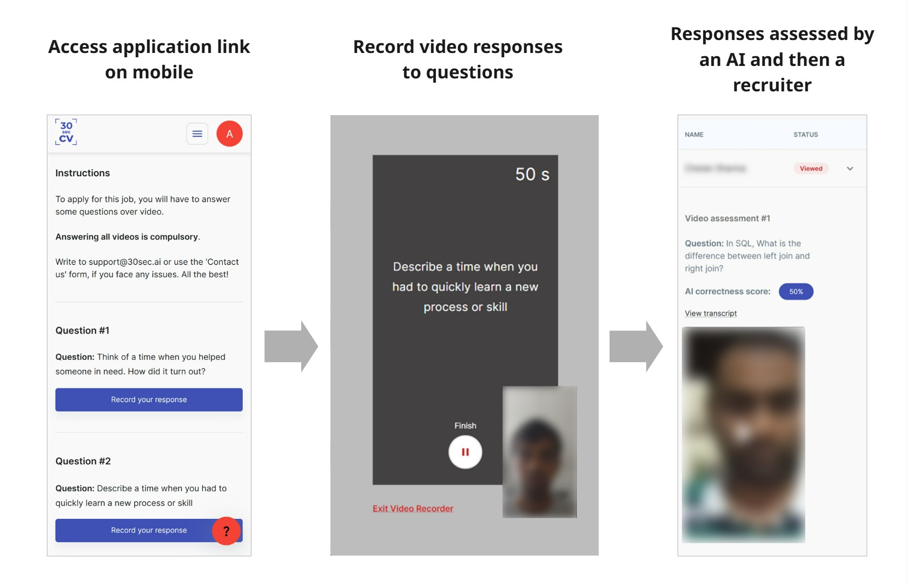
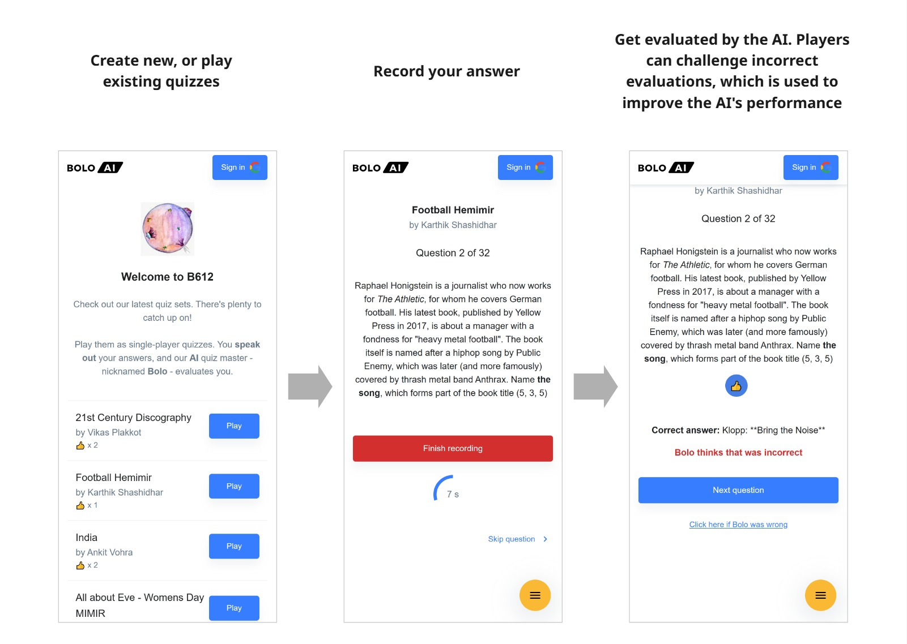
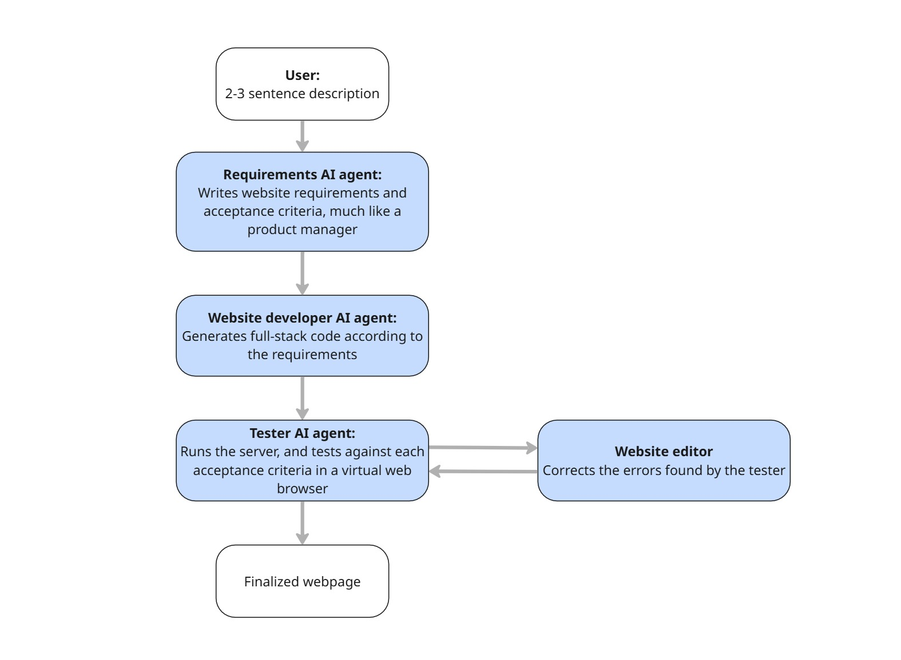

# Ananth Gopal's portfolio - AI and Software Projects

- [AI-Powered Video Recruitment Platform](#ai-powered-video-recruitment-platform)
- [Bolo AI: Voice-Based Quiz Platform](#voice-based-quiz-platform)
- [Fully automated website Developer & Tester (Langgraph)](#agentic-website-developer)

## AI-Powered Video Recruitment Platform

### Key Features
- Recruiters created job listings with customized questions
- Candidates recorded video responses directly in the browser without app installation
- An AI pipeline processed the videos and scored the videos
- Recruiters tracked application metrics and candidate statuses

### Technical Implementation
Developed solo from concept to deployment using Next.js, this project features:
- Google cloud based asynchronous pipelines for AI-post-processing of videos (serverless functions & cloud storage)
- Mobile-first frontend using React & Material UI
- Full-stack implementation in Next.js

> #### 🚀🚀 Try the video application interface - [Click here](https://www.30sec.ai/apply/caratlane-jewellery-consultant)

 

--- 

## Voice-Based Quiz Platform

### Overview
Bolo AI is an innovative quiz platform where users answer questions verbally rather than typing, inspired by retrieval practice techniques that strengthen long-term memory formation. An AI-powered system automatically evaluates spoken responses.

### Key Features
- Voice response recognition for answering quiz questions
- AI-powered answer evaluation and scoring system
- Community-driven feedback mechanism to improve accuracy
- Quiz creation tools for members to build custom quizzes

### Technical Implementation
- Frontend using React & Material UI
- Full-stack implementation in Next.js
- Speech recognition using OpenAI APIs
- AI evaluation of answers using Google cloud (serverless fucntions & cloud storage) linked with MongoDB as database
- Python pipelines for periodically scanning community feedback and improving AI accuracy

> #### 🚀🚀 Try out the quiz AI - [Play a quiz](https://quiz.30sec.ai/leagues/b612)

 

---

## Agentic Website Developer & Tester

### Overview
An AI-powered system that automatically generates and tests single-page websites from simple text descriptions. This project utilizes large language models (LLMs) and browser automation to create fully functional Flask-based websites with minimal human input.

### Key Features
- Natural language to website conversion through AI interpretation
- Automated requirements and acceptance criteria generation
- Complete Flask website implementation (HTML, CSS, JavaScript)
- Automated browser testing against generated criteria
- Iterative improvement cycle to meet all requirements

### Technical Implementation
The project employs a sophisticated directed graph-based workflow built with:
- LangChain for LLM integration
- LangGraph for workflow orchestration
- Browser-use for browser automation testing

> #### 🚀🚀 Check out the [full Github repo by clicking here](https://github.com/ta-klauz/agentic-website-dev)

 

---

## Contact & Links

- **GitHub**: [github.com/ta-klauz](https://github.com/ta-klauz)

Feel free to reach out for collaborations, questions, or further discussion about any of these projects!
